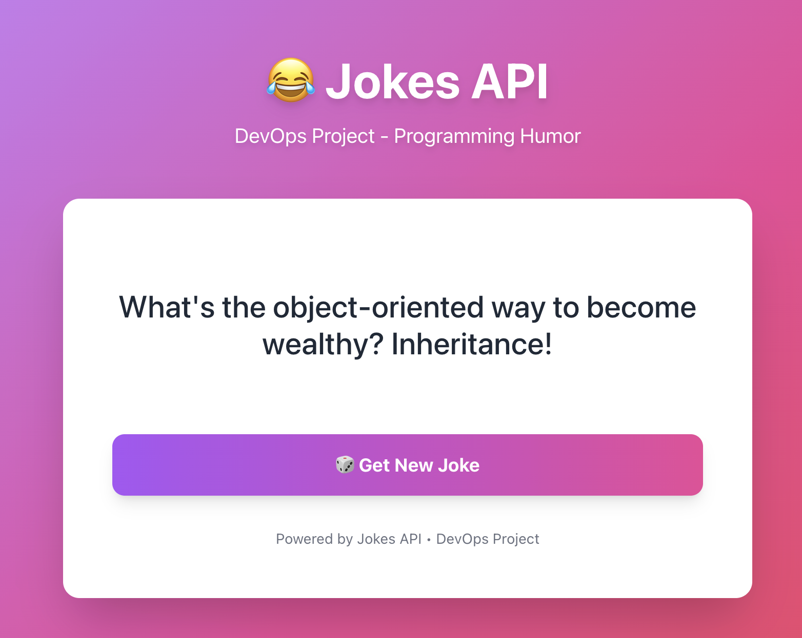

# Jokes API - DevOps Project



A full-stack application demonstrating modern DevOps practices including containerization, orchestration, and automated CI/CD pipelines with comprehensive security scanning.

## Table of Contents

- [Overview](#overview)
- [Architecture](#architecture)
- [Technology Stack](#technology-stack)
- [Project Structure](#project-structure)
- [Getting Started](#getting-started)
- [Development](#development)
- [Testing](#testing)
- [Docker Deployment](#docker-deployment)
- [Kubernetes Deployment](#kubernetes-deployment)
- [CI/CD Pipeline](#cicd-pipeline)
- [Security](#security)
- [API Documentation](#api-documentation)

## Overview

This project is a comprehensive demonstration of a modern DevOps workflow, implementing:

- **Full-stack application**: Node.js/Express backend with React frontend
- **Containerization**: Multi-stage Docker builds with security hardening
- **Orchestration**: Production-ready Kubernetes manifests with autoscaling
- **CI/CD**: Automated GitHub Actions pipeline with SAST security scanning
- **Comprehensive documentation**: Detailed guides for all components

The application serves random programming jokes through a REST API, with a modern responsive frontend.

## Architecture

### Application Architecture

```
┌─────────────────────────────────────────────────────────┐
│                    Users / Browsers                      │
└───────────────────────────┬─────────────────────────────┘
                            │
                ┌───────────▼───────────┐
                │   Ingress / LB        │
                │   (Port 80)           │
                └───────────┬───────────┘
                            │
            ┌───────────────┴────────────────┐
            │                                │
    ┌───────▼────────┐            ┌─────────▼────────┐
    │   Frontend     │            │    Backend       │
    │   (React)      │───────────▶│   (Express)      │
    │   Port 80      │   API      │   Port 5000      │
    │   2 replicas   │   Calls    │   2 replicas     │
    └────────────────┘            └────────┬─────────┘
                                           │
                                  ┌────────▼─────────┐
                                  │   PostgreSQL     │
                                  │   Database       │
                                  │   Port 5432      │
                                  └──────────────────┘
```

### DevOps Pipeline Architecture

```
Git Push → CI → Security Scanning → Build → Container Scan → Deploy
   │       │            │              │           │           │
   │       ├─ Lint      ├─ npm audit  ├─ Docker  ├─ Trivy   ├─ Docker Hub
   │       ├─ Test      ├─ CodeQL     └─ Build   └─ SARIF   └─ K8s Ready
   │       └─ Build     ├─ Sonal Cloud   Images     Upload
```

## Technology Stack

### Backend

| Technology | Purpose                    | Version |
| ---------- | -------------------------- | ------- |
| Node.js    | Runtime environment        | 18      |
| Express.js | Web framework              | 4.18.2  |
| PostgreSQL | Database                   | 16      |
| Knex.js    | Query builder & migrations | 3.1.0   |
| pg         | PostgreSQL driver          | 8.11.3  |
| CORS       | Cross-origin requests      | 2.8.5   |
| Jest       | Testing framework          | 29.7.0  |
| Supertest  | HTTP testing               | 6.3.3   |

### Frontend

| Technology   | Purpose           | Version |
| ------------ | ----------------- | ------- |
| React        | UI library        | 18.2.0  |
| Vite         | Build tool        | 5.0.8   |
| Tailwind CSS | Styling framework | 3.4.0   |
| Nginx        | Production server | Alpine  |

### DevOps & Infrastructure

| Technology     | Purpose                  |
| -------------- | ------------------------ |
| Docker         | Containerization         |
| Docker Compose | Local orchestration      |
| Kubernetes     | Production orchestration |
| GitHub Actions | CI/CD automation         |
| npm audit      | Dependency scanning      |
| CodeQL         | Static code analysis     |
| Trivy          | Container scanning       |
| Alpine Linux   | Base images              |
| Sonar Cloud    | Code scannig             |

## Project Structure

```
DeveopsJokeApi/
├── backend/
│   ├── server.js           # Express server with /api/joke endpoint
│   ├── server.test.js      # Jest unit tests
│   ├── migrations.test.js  # Database migration integration tests
│   ├── db.js               # Knex database connection module
│   ├── knexfile.js         # Knex configuration (dev/prod/test)
│   ├── docker-entrypoint.sh # Migration runner for Docker
│   ├── migrations/         # Database migration files
│   │   └── 20251216000001_create_jokes_table.js
│   ├── seeds/              # Database seed files
│   │   └── 01_jokes.js
│   ├── Dockerfile          # Multi-stage Dockerfile
│   ├── package.json        # Backend dependencies
│   └── README.md
├── frontend/
│   ├── src/
│   │   ├── components/
│   │   │   └── JokeCard.jsx    # Main joke display component
│   │   ├── App.jsx
│   │   ├── main.jsx
│   │   └── index.css
│   ├── Dockerfile          # Multi-stage Nginx Dockerfile
│   ├── nginx.conf          # Custom Nginx configuration
│   ├── vite.config.js
│   ├── tailwind.config.js
│   ├── package.json        # Frontend dependencies
│   └── README.md
├── k8s/                    # Kubernetes manifests
│   ├── namespace.yaml
│   ├── backend-deployment.yaml
│   ├── backend-service.yaml
│   ├── frontend-deployment.yaml
│   ├── frontend-service.yaml
│   ├── ingress.yaml
│   ├── *-hpa.yaml         # Horizontal Pod Autoscalers
│   └── README.md
├── .github/workflows/
│   └── pipeline.yml        # CI/CD with SAST scanning + Migration Stress Test
├── docker-compose.yml      # Docker Compose with PostgreSQL
├── k8s-start.sh           # Minikube startup script
├── k8s-stop.sh            # Minikube cleanup script
├── DOCKER.md              # Docker documentation
├── CICD.md                # CI/CD pipeline documentation
├── package.json           # Root package.json with monorepo scripts
└── README.md              # This file
```

## Getting Started

### Prerequisites

Choose one of the following deployment methods based on your environment:

#### Local Development

- Node.js v18 or higher
- npm v8 or higher

#### Docker Deployment (Recommended)

- Docker Engine 20.10+
- Docker Compose 2.0+

#### Kubernetes Deployment

- Kubernetes cluster (Minikube, GKE, EKS, AKS, etc.)
- kubectl CLI tool
- For local testing: Minikube 1.25+

### Quick Start

#### 1. Docker Compose (Fastest)

```bash
# Clone the repository
git clone https://github.com/Bogomil-Stoyanov/DevopsJokesApi.git
cd DevopsJokesApi

# Start all services (PostgreSQL, backend, frontend)
docker-compose up -d

# View logs
docker-compose logs -f

# Wait for migrations to complete (backend will run migrations automatically)
# Check backend logs: docker-compose logs backend

# Access the application
# Frontend: http://localhost
# Backend API: http://localhost:5000
# PostgreSQL: localhost:5432 (user: postgres, password: postgres, db: jokes_db)
```

#### 2. Kubernetes with Minikube

```bash
# Start Minikube
minikube start

# Deploy everything (automated)
./k8s-start.sh

# The script will:
# - Build Docker images
# - Deploy to Kubernetes
# - Start port forwarding
# - Open the application in your browser
```

#### 3. Local Development

```bash
# Install all dependencies
npm run install:all

# Set up PostgreSQL database locally
# Option 1: Use Docker for database only
docker run -d \
  --name jokes-db \
  -e POSTGRES_USER=postgres \
  -e POSTGRES_PASSWORD=postgres \
  -e POSTGRES_DB=jokes_db \
  -p 5432:5432 \
  postgres:16-alpine

# Option 2: Use local PostgreSQL installation
# Create database: createdb jokes_db

# Run migrations and seeds
cd backend
npm run migrate
npm run seed

# Start both services in development mode
cd ..
npm run dev

# Backend will run on http://localhost:5000
# Frontend will run on http://localhost:3000
```

## Development

### Monorepo Structure

This project uses a monorepo structure with shared scripts at the root level:

```bash
# Install all dependencies (backend + frontend)
npm run install:all

# Run both services concurrently
npm run dev

# Run backend only
npm run backend

# Run frontend only
npm run frontend

# Run tests
npm test
```

### Backend Development

```bash
cd backend

# Install dependencies
npm install

# Database Setup (choose one)
# Option 1: Docker PostgreSQL
docker run -d --name jokes-db -e POSTGRES_PASSWORD=postgres -p 5432:5432 postgres:16-alpine

# Option 2: Local PostgreSQL
# Ensure PostgreSQL is running and create database
createdb jokes_db

# Run database migrations
npm run migrate

# Seed the database with jokes
npm run seed

# Start development server (with hot reload)
npm run dev

# Run tests (includes migration integration tests)
npm test

# Run specific test file
npm test server.test.js
npm test migrations.test.js

# Run tests with coverage
npm run test:coverage

# Database management commands
npm run migrate          # Run all pending migrations
npm run migrate:rollback # Rollback last batch of migrations
npm run seed             # Run seed files
npm run db:setup         # Complete setup: migrate + seed
```

The backend server will start on `http://localhost:5000` with the following endpoints:

- `GET /api/joke` - Random joke from database
- `GET /health` - Health check (includes database connection test)
- `GET /` - Welcome message

### Frontend Development

```bash
cd frontend

# Install dependencies
npm install

# Start development server
npm run dev

# Build for production
npm run build

# Preview production build
npm run preview
```

The frontend development server will start on `http://localhost:3000`.

### Environment Variables

#### Backend

The backend uses the following environment variables:

```bash
# Server Configuration
PORT=5000                    # Server port (default: 5000)
NODE_ENV=development         # Environment: development, production, or test

# Database Configuration (PostgreSQL)
DB_HOST=localhost            # Database host (default: localhost)
DB_PORT=5432                 # Database port (default: 5432)
DB_NAME=jokes_db             # Database name (default: jokes_db)
DB_USER=postgres             # Database user (default: postgres)
DB_PASSWORD=postgres         # Database password (default: postgres)
```

**Database Environments:**

- **Development**: Uses local PostgreSQL (localhost:5432/jokes_db)
- **Production**: Uses environment variables with SSL support
- **Test**: Uses separate test database (jokes_db_test) for isolation

#### Frontend

Create a `.env` file in the frontend directory:

```bash
VITE_API_URL=http://localhost:5000    # Backend API URL
```

For Docker/Kubernetes deployments, these are configured automatically via ConfigMaps.

## Testing

### Backend Unit Tests

The backend includes comprehensive unit tests for all API endpoints:

```bash
# Run all tests (unit + integration)
npm test

# Run specific test suites
cd backend
npm test server.test.js           # API endpoint tests
npm test migrations.test.js       # Database migration tests

# Run tests with coverage report
npm run test:coverage

# Run tests in watch mode
npm test -- --watch
```

**Test Coverage:**

- API endpoint tests (`server.test.js`)
  - GET /api/joke returns random joke
  - GET /health returns server status
  - Error handling and edge cases
- Database migration tests (`migrations.test.js`)

  - Migration up (table creation)
  - Data operations (insert, query, RANDOM())
  - Migration down (rollback)
  - Migration recovery (re-apply after rollback)
  - Schema validation

- API endpoint validation (status codes, response format)
- Joke data structure verification
- Health check endpoint
- Error handling

### Manual API Testing

```bash
# Test joke endpoint
curl http://localhost:5000/api/joke

# Test health endpoint
curl http://localhost:5000/health

# Expected joke response format:
{
  "id": 1,
  "joke": "Why do programmers prefer dark mode? Because light attracts bugs!"
}
```

## Docker Deployment

### Architecture

The application uses **multi-stage Docker builds** for optimization and security, with **PostgreSQL database** for persistent storage:

**Backend Dockerfile stages:**

1. **Dependencies**: Install production dependencies only
2. **Build**: Install dev dependencies and run tests
3. **Production**: Copy production code, install PostgreSQL client, run migrations via entrypoint

**Frontend Dockerfile stages:**

1. **Build**: Build React app with Vite
2. **Production**: Serve with Nginx Alpine (non-root user)

**Database:**

- PostgreSQL 16 Alpine image
- Automatic health checks with `pg_isready`
- Persistent volume for data storage
- Backend waits for database to be healthy before starting

### Quick Start

```bash
# Start all services (database, backend, frontend)
docker-compose up -d

# View logs
docker-compose logs -f

# Watch backend migrations
docker-compose logs -f backend

# Stop services
docker-compose down

# Stop and remove volumes (clears database)
docker-compose down -v

# Rebuild and start
docker-compose up --build
```

### Access Points

- **Frontend**: http://localhost:80 (or http://localhost)
- **Backend API**: http://localhost:5000
- **Backend Health**: http://localhost:5000/health (includes database connection check)
- **Frontend Health**: http://localhost/health
- **PostgreSQL**: localhost:5432 (user: postgres, password: postgres, database: jokes_db)

### Database Management

```bash
# Run migrations manually
docker-compose exec backend npm run migrate

# Rollback migrations
docker-compose exec backend npm run migrate:rollback

# Seed database
docker-compose exec backend npm run seed

# Access PostgreSQL directly
docker-compose exec db psql -U postgres -d jokes_db

# View jokes table
docker-compose exec db psql -U postgres -d jokes_db -c "SELECT * FROM jokes LIMIT 5;"
```

### Security Features

✅ **Multi-stage builds** - Smaller image sizes, no build tools in production  
✅ **Non-root users** - Both containers run as UID 1001  
✅ **Minimal base images** - Alpine Linux for reduced attack surface  
✅ **Health checks** - Built-in monitoring for container and database health  
✅ **Production dependencies only** - No dev tools in final images  
✅ **Security headers** - HSTS, CSP, X-Frame-Options (frontend)  
✅ **Resource limits** - CPU and memory constraints
✅ **Database isolation** - PostgreSQL runs in separate container with health checks
✅ **Automatic migrations** - Backend entrypoint runs migrations before starting server

### Individual Container Management

```bash
# Build backend image
cd backend
docker build -t jokes-api-backend:latest .

# Run backend container
docker run -p 5000:5000 jokes-api-backend:latest

# Build frontend image
cd frontend
docker build -t jokes-api-frontend:latest .

# Run frontend container
docker run -p 80:80 jokes-api-frontend:latest
```

**For detailed Docker documentation**, see [DOCKER.md](./DOCKER.md)

## Kubernetes Deployment

### Architecture Overview

The Kubernetes deployment includes:

- **Namespace isolation** (`jokes-api`)
- **ConfigMap** for environment configuration
- **Deployments** with 2 replicas and rolling updates
- **Services** for internal and external access
- **Horizontal Pod Autoscaler (HPA)** for dynamic scaling
- **Ingress** for HTTP routing and load balancing
- **Resource quotas** and limits
- **Health probes** (liveness and readiness)

### Resource Configuration

#### Backend Pods

- **Replicas**: 2 (scales 2-10 based on load)
- **CPU**: 100m request, 500m limit
- **Memory**: 128Mi request, 256Mi limit
- **Service**: ClusterIP (internal only)

#### Frontend Pods

- **Replicas**: 2 (scales 2-8 based on load)
- **CPU**: 50m request, 200m limit
- **Memory**: 64Mi request, 128Mi limit
- **Service**: LoadBalancer (external access)

### Deployment Options

#### Option 1: Automated Script (Minikube)

```bash
# Start everything automatically
./k8s-start.sh

# This script:
# 1. Checks Minikube status
# 2. Enables required addons (ingress, metrics-server)
# 3. Builds Docker images in Minikube's Docker environment
# 4. Deploys all Kubernetes manifests
# 5. Starts port forwarding for backend
# 6. Opens Minikube tunnel for frontend
```

#### Option 2: Manual Deployment

```bash
# Apply all manifests
kubectl apply -f k8s/

# Check deployment status
kubectl get all -n jokes-api

# View pod logs
kubectl logs -f -n jokes-api deployment/backend-deployment

# Access frontend (Minikube)
minikube service frontend-service -n jokes-api

# Port forward backend
kubectl port-forward -n jokes-api service/backend-service 5000:5000
```

#### Option 3: Deploy Script

```bash
# Use the deployment script
cd k8s
./deploy.sh

# Cleanup
./cleanup.sh
```

### Monitoring and Scaling

```bash
# Watch pods scaling
kubectl get hpa -n jokes-api --watch

# View pod resource usage
kubectl top pods -n jokes-api

# Scale manually (if HPA is disabled)
kubectl scale deployment backend-deployment --replicas=3 -n jokes-api

# View events
kubectl get events -n jokes-api --sort-by='.lastTimestamp'
```

### Stopping and Cleanup

```bash
# Interactive cleanup script
./k8s-stop.sh

# Options:
# 1 - Stop Minikube completely
# 2 - Delete application only (keep Minikube running)
# 3 - Both

# Or manual cleanup
kubectl delete namespace jokes-api
```

**For complete Kubernetes documentation**, see [k8s/README.md](./k8s/README.md)

## CI/CD Pipeline

### Pipeline Overview

The project includes a comprehensive GitHub Actions pipeline that runs on:

- Push to `master` branch
- Pull requests to `master`
- Manual workflow dispatch

### Pipeline Stages

**Stage 1: CI & Testing**

- Checkout code
- Install dependencies (backend and frontend)
- Run linting (if lint scripts exist)
- Execute unit tests
- Build frontend

**Stage 2: Database Migration Stress Test** -

- PostgreSQL 16 service container with health checks
- Run migrations up (create tables)
- Verify table creation
- Seed database with 30+ jokes
- Verify seeded data count (minimum 20 jokes)
- Test RANDOM() query functionality
- Rollback migrations (drop tables)
- Verify table removal
- Re-apply migrations (recovery test)
- Verify table recreation
- Run integration tests
- Generate migration stress test report

**Stage 3: Security Scanning (SAST)** - _Deep Dive Focus_

_3A. Dependency Scanning (npm audit)_

- Scans `package-lock.json` for known vulnerabilities
- Fails on HIGH or CRITICAL severity issues
- Generates detailed audit reports

_3B. Static Code Analysis (CodeQL)_

- Semantic code analysis for JavaScript
- Detects security vulnerabilities (XSS, injection, etc.)
- Results uploaded to GitHub Security tab

**Stage 4: Build Docker Images**

- Multi-stage Docker builds
- Layer caching for performance
- Images saved as artifacts

**Stage 5: Container Security Scanning (Trivy)**

- Scans built Docker images for vulnerabilities
- Checks OS packages and application dependencies
- Fails on HIGH or CRITICAL findings
- SARIF reports uploaded to GitHub Security

**Stage 6: Delivery** (master branch only)

- Login to Docker Hub
- Tag images with SHA and `latest`
- Push to Docker Hub registry

### Security Scanning Details

The pipeline implements four layers of security and reliability testing:

1. **Database Migration Stress Test**: Validates migration up/down/recovery cycle with PostgreSQL service container
2. **npm audit**: Catches vulnerable dependencies before building
3. **CodeQL**: Identifies security issues in source code
4. **Trivy**: Scans final container images for vulnerabilities

**Severity Thresholds:**

- ❌ CRITICAL: Build fails
- ❌ HIGH: Build fails
- ⚠️ MODERATE: Warning only
- ✅ LOW: Informational

### Required Secrets

To enable Docker Hub delivery, configure these in GitHub repository settings:

| Secret Name          | Description                            |
| -------------------- | -------------------------------------- |
| `DOCKERHUB_USERNAME` | Your Docker Hub username               |
| `DOCKERHUB_TOKEN`    | Docker Hub access token (not password) |

**Creating Docker Hub token:**

1. Login to Docker Hub
2. Account Settings → Security → New Access Token
3. Name: `github-actions`
4. Permissions: Read, Write, Delete
5. Copy token and add to GitHub Secrets

### Viewing Pipeline Results

- **Workflow runs**: Actions tab in GitHub repository
- **Security alerts**: Security tab → Code scanning alerts
- **Dependency vulnerabilities**: Security tab → Dependabot alerts
- **Artifacts**: Download from workflow run page

**For comprehensive CI/CD documentation**, see [CICD.md](./CICD.md)

## API Documentation

### Endpoints

#### GET /api/joke

Returns a random programming joke from the PostgreSQL database.

**Request:**

```bash
curl http://localhost:5000/api/joke
```

**Response:** `200 OK`

```json
{
  "id": 1,
  "joke": "Why do programmers prefer dark mode? Because light attracts bugs!"
}
```

**Implementation:** Uses SQL `ORDER BY RANDOM()` for true random selection from database.

**Error Responses:**

- `404 Not Found` - No jokes found in database
- `500 Internal Server Error` - Database connection error

```json
{
  "error": "Failed to fetch joke"
}
```

#### GET /health

Health check endpoint for monitoring and readiness probes.

**Request:**

```bash
curl http://localhost:5000/health
```

**Response:** `200 OK`

```json
{
  "status": "OK",
  "database": "connected"
}
```

**Implementation:** Tests database connection with `SELECT 1` query.

**Error Response:** `503 Service Unavailable` (if database is down)

```json
{
  "status": "unhealthy",
  "database": "disconnected"
}
```

#### GET /

Welcome endpoint.

**Response:** `200 OK`

```
Welcome to Jokes API!
```

## Project Status

### DevOps Topics Implemented

This project successfully implements **10 out of 13** required DevOps topics (minimum: 7):

✅ **Source control** - Git with GitHub  
✅ **Branching strategies** - Feature branches (dockerization, ci-cd, k8s, database)  
✅ **Building Pipelines** - GitHub Actions multi-stage workflow  
✅ **Continuous Integration** - Automated testing and linting  
✅ **Continuous Delivery** - Automated Docker Hub deployment  
✅ **Security** - _Deep dive: npm audit, CodeQL, Trivy scanning_  
✅ **Docker** - Multi-stage builds, Docker Compose  
✅ **Kubernetes** - Complete manifests with HPA and ingress  
✅ **Infrastructure as code** - All configuration as YAML/code  
✅ **Database changes** - PostgreSQL with Knex migrations, automated migration stress testing (up/down/rollback verification) in CI/CD pipeline

### Project Phases

✅ **Phase 1**: Code Scaffolding - Backend API, Frontend React app, unit tests  
✅ **Phase 2**: Docker Containerization - Multi-stage builds, security hardening  
✅ **Phase 3**: Kubernetes Deployment - Production manifests, autoscaling  
✅ **Phase 4**: CI/CD with SAST - GitHub Actions pipeline with security scanning  
✅ **Phase 5**: Database Implementation - PostgreSQL with Knex.js migrations, versioned schema changes, automated stress testing in CI/CD

### Database Implementation Details

The project includes a production-ready PostgreSQL database layer with:

- **Migration Management**: Knex.js for versioned schema changes with up/down functions
- **Data Seeding**: 30+ programming and DevOps jokes for initial data
- **Three Environments**: Development, Production (with SSL), and Test (isolated database)
- **Docker Integration**: PostgreSQL container with health checks, automatic migrations on startup
- **CI/CD Testing**: Migration stress test job that validates:
  - Migration up (table creation)
  - Data seeding and verification
  - RANDOM() query functionality
  - Migration down (rollback)
  - Table removal verification
  - Migration recovery (re-apply)
  - Integration test suite
- **Production Features**: Connection pooling, graceful shutdown, health monitoring

## Documentation

- [README.md](./README.md) - This file (project overview)
- [DOCKER.md](./DOCKER.md) - Complete Docker documentation
- [CICD.md](./CICD.md) - CI/CD pipeline details and security scanning
- [k8s/README.md](./k8s/README.md) - Kubernetes deployment guide
- [backend/README.md](./backend/README.md) - Backend service documentation
- [frontend/README.md](./frontend/README.md) - Frontend application documentation

---
